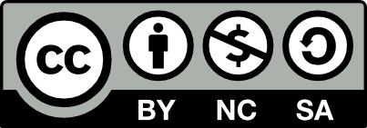

# உரிமங்கள்
இந்த வலைப்பதிவின் அனைத்து பதிவுகளும் [படைப்பாக்கப் பொதுமங்கள் – குறிப்பிடுதல், வர்த்தகநோக்கமற்ற, அதே மாதிரிப் பகிர்தல்](https://ta.wikipedia.org/wiki/%E0%AE%AA%E0%AE%9F%E0%AF%88%E0%AE%AA%E0%AF%8D%E0%AE%AA%E0%AE%BE%E0%AE%95%E0%AF%8D%E0%AE%95%E0%AE%AA%E0%AF%8D_%E0%AE%AA%E0%AF%8A%E0%AE%A4%E0%AF%81%E0%AE%AE%E0%AE%99%E0%AF%8D%E0%AE%95%E0%AE%B3%E0%AE%BF%E0%AE%A9%E0%AF%8D_%E0%AE%89%E0%AE%B0%E0%AE%BF%E0%AE%AE%E0%AE%99%E0%AF%8D%E0%AE%95%E0%AE%B3%E0%AF%8D) உரிமையுடன் பகிரப்பட்டுள்ளன.

இத்தளத்தில் கொடுக்கப்பட்டுள்ள வலைத்தொடுப்புகள் மூலம் நீங்கள் செல்லும் பிற வலைப்பதிவுகள் மற்றும் இணைய தளங்கள் அவர்களுக்கான காப்புரிமை குறிக்கோள்களை பின்பற்றுவர். அதற்கு இந்த வலைப்பதிவு பொறுப்பேற்காது.